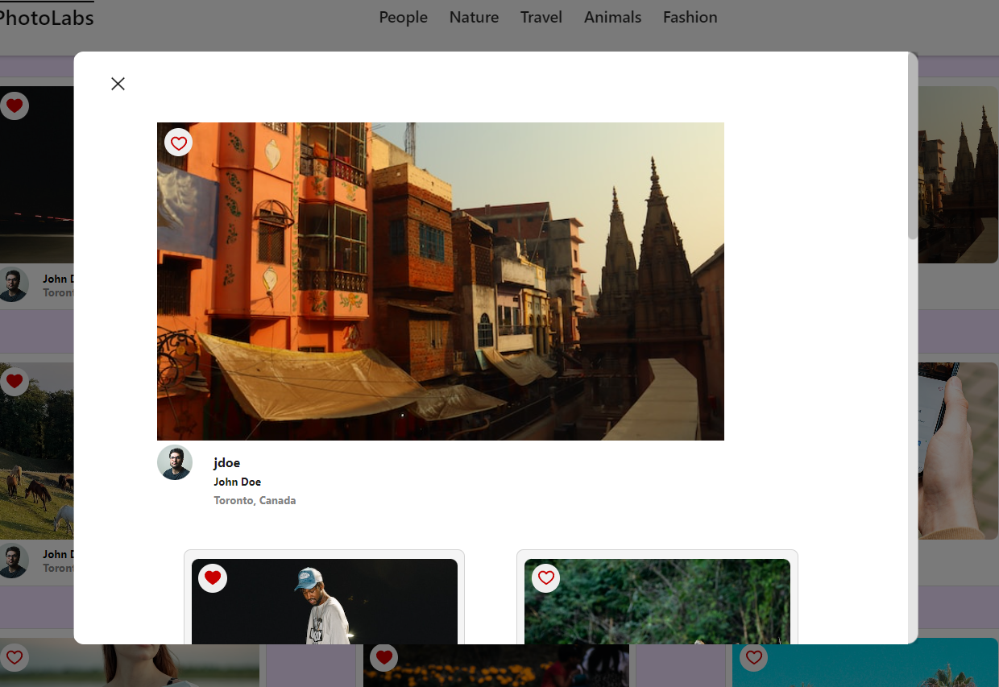
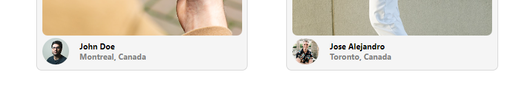
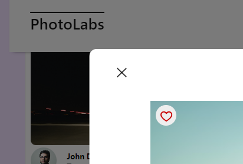
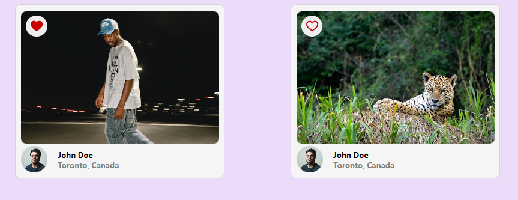
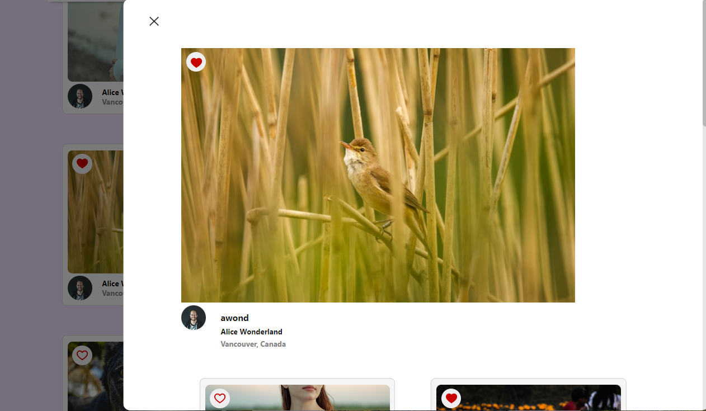
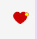
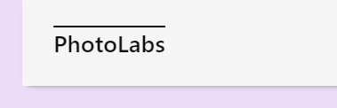
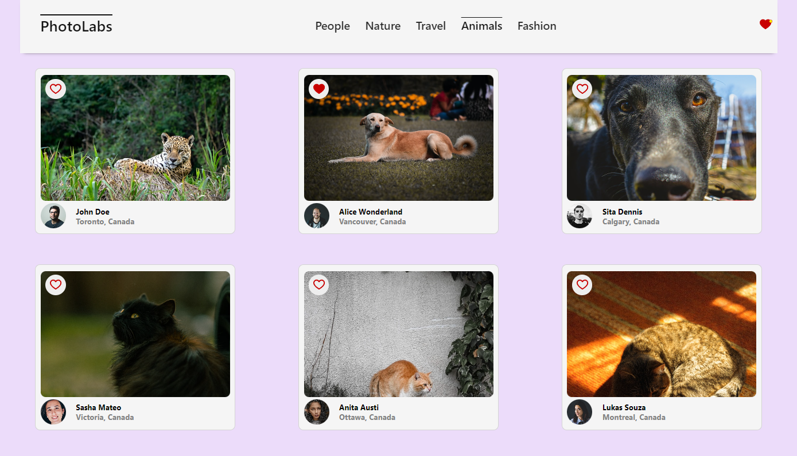
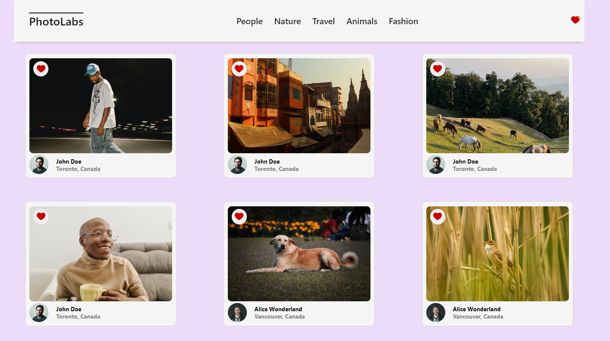

# react-photolabs
The PhotoLabs project for the Lighthouse Labs Web Development React course programming.

# Photolabs

- a simple SinglePageApp(SPA):
  - the user can open a modal for an individual photo:
  
    - the user can learn about photographer and location.
    - the user can find similar photos by photographer.
    - the user can find similar photos by location.
    
    - the user can close the modal by clicking on the X in the top left. 
    
  - the user can "favourite" photos:
   
    - favourited photos are added to a global-state array and faves persist across components.
     
    - if the user has one or more favourited photos, the fave button in nav has a small visible notification. 
    - the user may remove a photo from faves anywhere that the photo is visible by clicking the favIcon again. 
  - navigation functionality:
    - the user can always return to "Home" where no sorting is done by clicking the logo in the navbar.
     
    - the user can display photos sorted by topics.
    
      - the user can click this topic again to unsort.
      - the user can click a different topic to change sorting.
      - user can exit topics by returning "Home".
    - the user can display photos sorted by faves.
     
      - user can further sort faves by topic by clicking on the topics in the nav bar.
      - user can also exit faves by returning "Home".
  
  - the data rendered by this app is pulled from the api/photos, and api/topics. 
    - this can be tested and altered in `/backend/src/db/schema/ --- `  

## Setup

Install dependencies with `npm install` in both `/frontend` and `/backend` directories.

## [Frontend] Running Webpack Development Server

```sh
cd frontend
npm start
```

## [Backend] Running Backend Servier

Read `backend/readme` for further setup details.

```sh
cd backend
npm start
```
